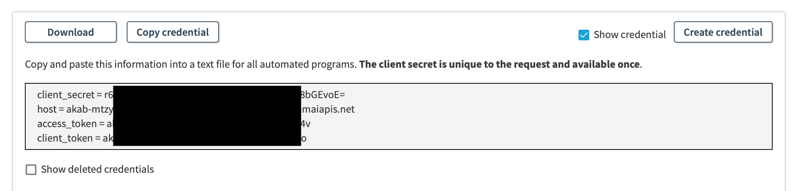

# Akamai Insights Datasource Plugin

Use the Akamai Insights Datasource Plugin for Grafana to visualize and observe reporting data.

## Install Grafana 7.0 or newer

Install Grafana version 7.0 or newer. Please be aware, since your package manager may install an older version, it's best to refer to official documentation 
[Install Grafana](https://grafana.com/docs/grafana/latest/installation/) which covers the details of the Grafana installation process for various operation systems

## Obtain Akamai API credentials

"Akamai Insights Datasource Plugin" gets data from the
[https://techdocs.akamai.com/reporting/v2/docs/welcome-rpt](https://techdocs.akamai.com/reporting/v2/docs/welcome-rpt).

You need to create an "API Client" with authorization to use the
[https://techdocs.akamai.com/reporting/v2/docs/welcome-rpt](https://techdocs.akamai.com/reporting/v2/docs/welcome-rpt).

See the "Get Started" section of [Reporting API v2](https://techdocs.akamai.com/reporting/v2/reference/get-started)
which says, "To enable this API, choose the API service named reporting-api, and set the access level to READ-WRITE".

Follow directions at [Authenticate With EdgeGrid](https://developer.akamai.com/getting-started/edgegrid) to generate
the required client credentials.

A customized version of those directions follows:

* Go to [Control Center](https://control.akamai.com/)
* Navigate to the "Identity & Access" page.
* Press "New API Client for Me"


* Select the "Advanced" option.
* Choose "Select APIs".
* Select "Reporting API" and "READ-WRITE" access.


* Press "Create API client"
* Copy the credentials (client_secret, host, access_token, and client token).



The credentials will later be entered into "Akamai Insights Datasource Plugin" configuration.

Note that Step 2 in [Authenticate With EdgeGrid](https://developer.akamai.com/getting-started/edgegrid)
"Decide which tool you’ll use to make requests" is not necessary. "Akamai Insights Datasource Plugin" makes
the requests.

## Installing this plugin on a local Grafana

### Linux OSs (Debian, Ubuntu, CentOS, Fedora, OpenSuse)

Configuration file: /etc/grafana/grafana.ini  
Plugin directory: /var/lib/grafana/plugins  
Log directory: /var/log/grafana/

* You may have to use 'sudo' to edit the configuration file or to view the log file.
* You may have to change permissons on the 'plugin' directory, for example: sudo chmod 777 /var/lib/grafana/plugins
* Under the plugin directory (/var/lib/grafana/plugins), create a directory called 'akamai-insights-datasource-plugin'.

From the dist directory, copy:
* LICENSE
* README.md
* img (directory and its contents)
* module.js
* module.js.LICENSE.txt
* module.js.map
* plugin.json  
  to /var/lib/grafana/plugins/akamai-insights-datasource-plugin

From the unzipped archive, copy one of (as appropriate for your hardware):
* gpx_akamai-insights-datasource-plugin_linux_amd64
* gpx_akamai-insights-datasource-plugin_linux_arm
* gpx_akamai-insights-datasource-plugin_linux_arm64  
  to /var/lib/grafana/plugins/akamai-insights-datasource-plugin

### macOS

Configuration file: /usr/local/etc/grafana/grafana.ini  
Plugin directory: /usr/local/var/lib/grafana/plugins  
Log directory: /usr/local/var/log/grafana/

Under the plugin directory (/usr/local/var/lib/grafana/plugins), create a directory called 'akamai-insights-datasource-plugin'.

From the unzipped archive, copy:
* LICENSE
* README.md
* img (directory and its contents)
* module.js
* module.js.LICENSE.txt
* module.js.map
* plugin.json
  to /usr/local/var/lib/grafana/plugins/akamai-insights-datasource-plugin

From the unzipped archive, copy:
* gpx_akamai-insights-datasource-plugin_darwin_amd64  
  to /var/lib/grafana/plugins/akamai-insights-datasource-plugin

### Windows

Grafana can be installed into any directory (install_dir).

Configuration file: install_dir\conf  
Plugin directory: install_dir\data\plugins  
Log directory: install_dir\data\log

Under the plugin directory (install_dir\data\plugins), create a directory called 'akamai-insights-datasource-plugin'.

From the unzipped archive, copy:
* LICENSE
* README.md
* img (directory and its contents)
* module.js
* module.js.LICENSE.txt
* module.js.map
* plugin.json
  to install_dir\data\plugins\akamai-insights-datasource-plugin

From the unzipped archive, copy:
* gpx_akamai-insights-datasource-plugin_windows_amd64.exe  
  to install_dir\data\plugins\akamai-insights-datasource-plugin

### Grafana configuration

[Configuration](https://grafana.com/docs/grafana/latest/administration/configuration/) describes configuration for each
operating system. Carefully read the directions.

* Using a text editor, open the configuration file (as described in [Configuration](https://grafana.com/docs/grafana/latest/administration/configuration/)).

* Under the [paths] section header, uncomment "plugins" by removing the semicolon. For example:
```
[paths]
# Directory where grafana will automatically scan and look for plugins
plugins = /var/lib/grafana/plugins
```
* To the right of "plugins =", insert the complete path to the plugin directory.  
  NOTE: The plugin directory differs by operating system!

* Under the [plugins] section header, uncomment "allow_loading_unsigned_plugins".
* To the right of "allow_loading_unsigned_plugins =", add "akamai-data-plugin" (without quotes). For example:
```
[plugins]
# Enter a comma-separated list of plugin identifiers to identify plugins that are allowed to be loaded even if they lack a valid signature.
allow_loading_unsigned_plugins = akamai-data-plugin
```

### Restart Grafana
[Restart Grafana](https://grafana.com/docs/grafana/latest/installation/restart-grafana/)
describes how to restart Grafana for each operating system.

Under the log directory for your operating system, in "grafana.log", you should see something similar to:
```
t=2021-03-24T10:31:09-0400 lvl=info msg="Registering plugin" logger=plugins id=akamai-data-plugin
```

[Troubleshooting](https://grafana.com/docs/grafana/latest/troubleshooting/) contains troubleshooting tips.

### Log in to Grafana
[Getting started with Grafana](https://grafana.com/docs/grafana/latest/getting-started/getting-started/)
describes how to log in to Grafana. The default username/password are: admin/admin.

## "Akamai Insights Datasource Plugin" Configuration

Select Configuration (gear icon) -> Datasources -> Akamai Insights Datasource Plugin

In the datasource configuration panel, enter your Akamai credentials.


Create a new dashboard and add a visualization. Select previously created datasource, use select component with placeholder
"Select report data source" to chose proper data source.

Fill form and apply query. Create additional queries, as needed.


